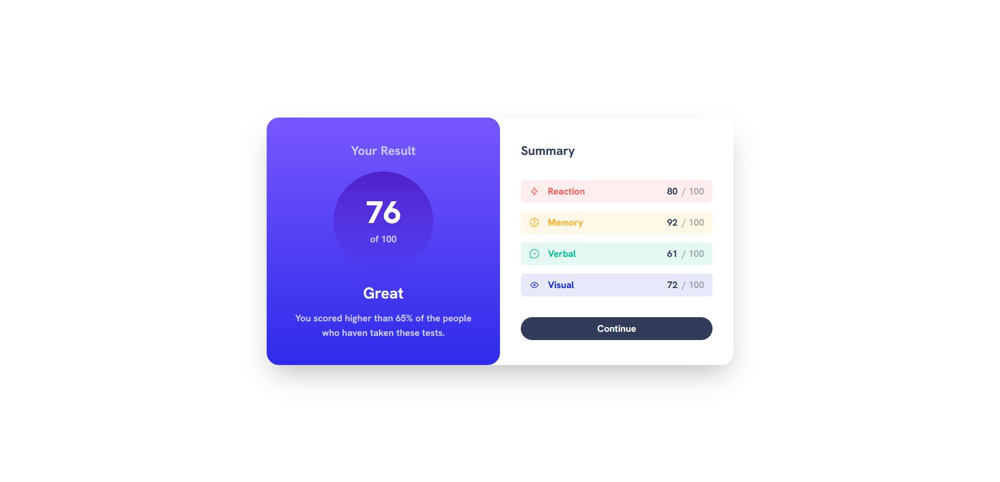

# Frontend Mentor - Results summary component solution

This is a solution to the [Results summary component challenge on Frontend Mentor](https://www.frontendmentor.io/challenges/results-summary-component-CE_K6s0maV). Frontend Mentor challenges help you improve your coding skills by building realistic projects.

## Table of contents

- [Overview](#overview)
  - [The challenge](#the-challenge)
  - [Screenshot](#screenshot)
  - [Links](#links)
- [My process](#my-process)
  - [Built with](#built-with)
  - [What I learned](#what-i-learned)
  - [Continued development](#continued-development)
- [Author](#author)

## Overview

### The challenge

Users should be able to:

- View the optimal layout for the interface depending on their device's screen size
- See hover and focus states for all interactive elements on the page

### Screenshot

### Links

- Solution URL: [Add solution URL here](https://www.frontendmentor.io/solutions/responsive-resultsummary-component-with-reacttypescripttailwindcss-s-AQetkvzT)
- Live Site URL: [Add live site URL here](https://fem-results-summary-mu.vercel.app)

## My process

### Built with

- [React](https://reactjs.org/) - JS library
- [Typescript](https://www.typescriptlang.org/) - JS Superset
- [Tailwind CSS](https://tailwindcss.com/) - CSS framework

### What I learned

This being my first real project working with more complex css, I learned a lot on how I could customize my own values on tailwindCSS and also learned the basics of using gradients on tailwindCSS.
I also learned more about creating a responsive design.

### Continued development

Overall I still need to learn a lot about responsive design. Maybe consider a Mobile-first workflow. From this experience I found it tricky to get the mobile design accurate.
I want to continue learning about placement and positioning because I found that my widths, heights, margins, paddings and such didn't came out the same as the design.

## Author

- Website - [Add your name here](https://www.paulojoliveira.com)
- Frontend Mentor - [@yourusername](https://www.frontendmentor.io/profile/yourusername)
- Twitter - [@paul0_oLiveir4](https://twitter.com/paul0_oLiveir4)
